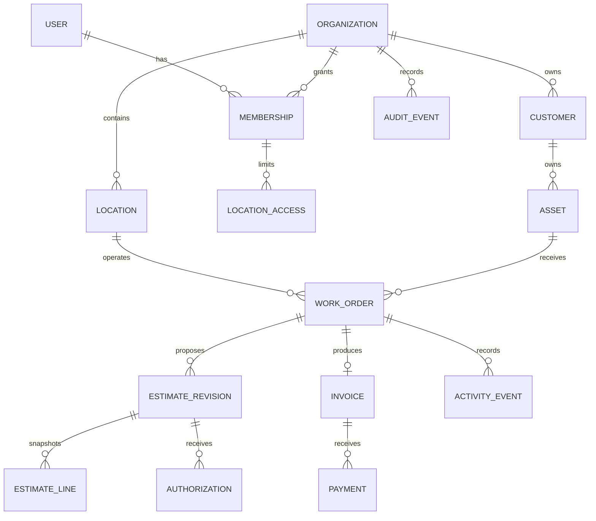

# Domain model

## Aggregate boundaries

- **Organization** owns settings, locations, subscription-ready state, terminology, and memberships.
- **Customer** owns its profile, contacts, addresses, preferences, and organization-specific reference.
- **Asset** belongs to one customer within one organization and may carry a typed industry profile.
- **Work order** coordinates concerns, service groups, assignments, statuses, activity, and blockers.
- **Estimate** owns ordered immutable revisions. A revision snapshots priced lines and presentation
  details.
- **Authorization** records decisions against a specific revision and explicit service groups or lines.
- **Invoice** snapshots billable work and owns payment allocations.

Transactions should not span aggregates merely for convenience. Application services coordinate them
inside a database transaction where partial completion would be unsafe.

## Core relationships

Every relationship between tenant-owned records must agree on `organization_id`. Location-scoped
relationships must also agree on `location_id` where applicable. Foreign keys alone do not guarantee
that agreement unless composite tenant keys or transaction-level validation enforce it.

## Asset extension strategy

The base `assets` record contains common searchable fields: category, display name, manufacturer, model,
year, serial number, status, usage type/value/unit, tags, and description.

Industry detail uses a small number of typed one-to-one profile tables such as
`automotive_asset_profiles` and `equipment_asset_profiles`. A constrained `custom_attributes` JSONB
object supports organization-defined, non-critical display metadata. Fields used for authorization,
money, lifecycle state, uniqueness, or frequent search belong in typed columns—not arbitrary JSON.

This balances reliable automotive UX with cross-industry flexibility and avoids a single sparse table.

## Work model

The first `repair` work type progresses through `draft`, `estimating`, `awaiting_authorization`,
`authorized`, `in_progress`, `blocked`, `completed`, `invoiced`, and `closed`, with `cancelled` as a
terminal alternative. Transition services enforce prerequisites. Future maintenance and project work
share Customer, Asset, pricing, authorization, invoice, history, and file capabilities while adding
their own scheduling, milestone, deposit, and change-order concepts.

## Estimate and authorization history

Draft revisions may change until presentation. Presenting an estimate seals the revision. Later changes
create a new revision with a link to its predecessor. Authorization always points to the exact presented
revision and explicit approved or declined scope. Completing work requires current authorization for
each authorization-required line.

## Financial assumptions

- Currency is fixed per estimate and invoice.
- Line amounts round half away from zero to minor units after quantity-times-unit-price calculation.
- Tax is calculated per tax category/rate over the taxable net line amount and rounded per line.
- Discounts cannot make a service group subtotal negative.
- A presented estimate has an explicit expiration instant or no expiration.
- An invoice is a new immutable snapshot; it does not silently follow later estimate edits.
- Manual payments may be partial but cannot produce a negative balance without an explicit credit model.

These assumptions are initial decisions and may require jurisdiction-specific tax providers later.
